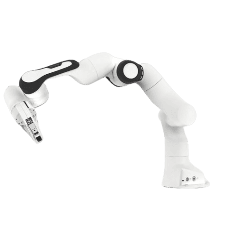
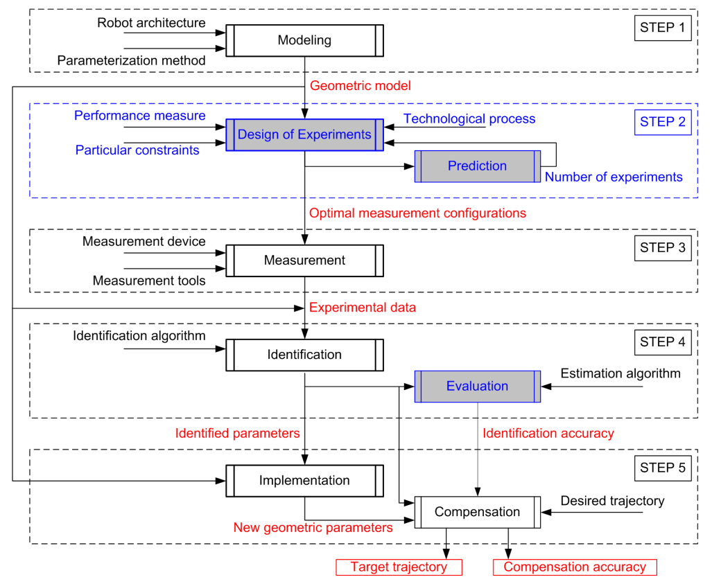
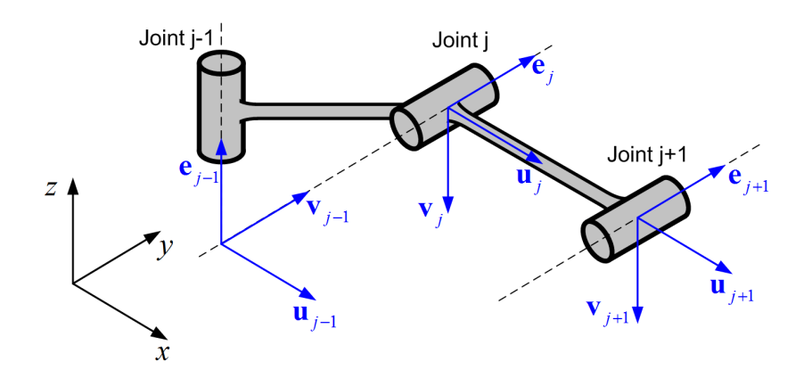
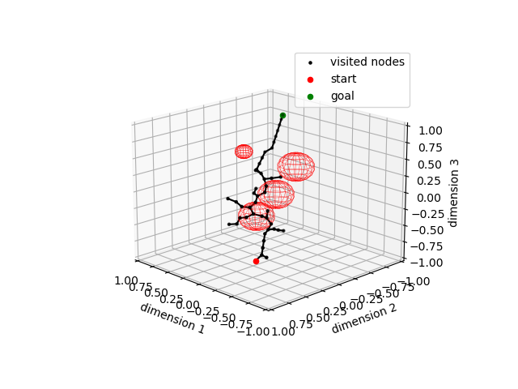
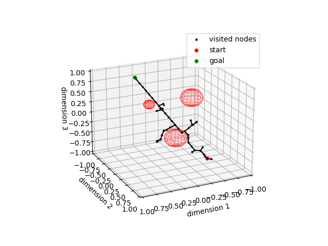

# Introduction
This repo containes educational examples on Franka Emika 7 DOF robot using python and robtotics toolbox and numpy. 
We hope that it will be helpful for students and engineers to get a better understanding for topics like calibration and control.


<p align="center">
  
</p>


# Geometric Calibration

## Theoritical Background

From a manifacturing stand point it is extremely challenging to produce robots with zero erros in joints lenghts. Therefore each produced manipulator has small errors from the factory. Keep in mind all these small errors will affect the accuracy if not considered. It has been reported by a number of authors, the manipulator geometric errors are responsible for about 90% of the total positioning errors.


<p align="center">
  
</p>
<p align = "center">
Fig.1.1 - The schematic of robot calibration procedure
</p>

1. The first step (modeling) is aimed at developing a suitable geometric model, which properly
describes the relation between the manipulator geometric parameters (link lengths and joint angles)
and the end-effector location (position and orientation).

2. The second step (design of experiments) is aimed at choosing optimal measurement
configurations. It should rely on an appropriate performance measure, which takes into account the
particularities of technological process. It should be also able to obtain solution within the work-cell
constraints, and to adjust the number of experiments based on the error estimation.

3. The third step (measurements) deals with carrying out calibration experiments using the
obtained configurations. Depending on the measurement methods (measurement tools and devices,
marker location, etc.), it may provide different experimental data (the end-effector position/location,
etc.).

4. At the fourth step (identification) the errors in geometric parameters are computed using the
corresponding model and proper identification algorithm. Using the experimental data, it is possible to
evaluate identification accuracy for the parameters of interest.

5. At the last step (implementation), the geometric errors are compensated by modification of
the geometric parameters embedded in the robot controller.


## Complete, irreducible geometric model
In this step we assum that the manipulator links are rigid enough and the non-geometric factors are negligible in this level of calibration, the general expression of the geometric model for a $n$ -dof serial manipulator can be described as a sequence of homogeneous transformations

$T(q) = T_{base}(  \pi_b) [ T_{joint}(q_1,   \pi_{q1}) . T_{link}(  \pi_{L1}) ] ... [ T_{joint}(q_n,   \pi_{qn}) . T_{link}(  \pi_{Ln}) ] T_{tool}(  \pi_t)$


where $T$ with different indices denote the relevant matrices of size $4 \times 4$ , $q$ is the vector of the actuated joint coordinates, while the vectors $π_b , π_t , π_{Lj}$ and the scalars $π_qj$ are the manipulator
geometric parameters corresponding to the base, tool, links and joints, respectively.

There are a number of techniques that allows us to obtain the manipulator model of such type, which is definitely complete but includes redundant parameters to be eliminated. 
In this work, we will use the model generation technique that is
based on dedicated analytical elimination rules and includes the following steps:

1. Construction of the complete and obviously reducible model in the form of
homogeneous matrices product.
  * The base transformation  $T_{Base}=[T_x T_y T_z R_x R_y R_z]_b$
  * The joint and link transformation $T_{joint,j} . T_{Link,j}$
    * for revolute joint $T_{joint,j} . T_{Link,j}= R_{e,j}(q_j,\pi_{qj}).[T_u T_v R_u R_v]_{Lj} $
    * for prismatic joint $T_{joint,j} . T_{Link,j}= T_{e,j}(q_j,\pi_{qj}).[R_u R_v ]_{Lj}$
  * The tool transformation $T_{tool}=[T_x T_y T_z R_x R_y R_z]_t$

2. Elimination of non-identifiable and semi-identifiable parameters in accordance with specific rules for different nature and structure of consecutive joints.
* For the case of consecutive revolute joint $R_{e,j}(q_j,\pi_{qj})$
  * if $e_j \perp e_{j-1}$ , eliminate the term $R_{u,L_{j-1}}$ or $R_{v,L_{j-1}}$ that corresponds to $R_{e,j}$
  * if $e_j \parallel  e_{j-1}$ , eliminate the term $T_{u,L_{j-k}}$ or $T_{v,L_{j-k}}$ that defines the translation orthogonal to the joint axes, for which $k$ is minimum $( k \geq 1 )$


* For the case of consecutive prismatic joint $T_{e,j}(q_j,\pi_{qj})$
  * if $e_j \perp e_{j-1}$ , eliminate the term $T_{u,L_{j-1}}$ or $T_{v,L_{j-1}}$  that corresponds to $T_{e,j}$
  * if $e_j \parallel  e_{j-1}$ , eliminate the term $T_{u,L_{j-k}}$ or $T_{v,L_{j-k}}$ that defines the translation in the direction of axis $e_j$ , for which $k$ is minimum $( k \geq 1 )$

<p align="center">
  
</p>
<p align = "center">
Fig.2.1 - Manipulator segment with perpendicular and parallel axes
</p>


Applying the previous steps to the 7-DoF Panda robot we got the following:
1. Complete (but redundant) reducable model: $T=[T_xT_yT_zR_xR_yR_z]_b.$
$R_z(q_1+\Delta q_1).[T_xT_yR_xR_y].$
$R_y(q_2+\Delta q_2).[T_xT_zR_xR_z].$
$R_z(q_3+\Delta q_3).[T_xT_yR_xR_y].$
$R_y(q_4+\Delta q_4).[T_xT_zR_xR_z].$
$R_z(q_5+\Delta q_5).[T_xT_yR_xR_y].$
$R_y(q_6+\Delta q_6).[T_xT_zR_xR_z].$
$R_z(q_7+\Delta q_7).[T_xT_yR_xR_y].$
$[T_xT_yT_zR_xR_yR_z]_t$

2. Applying the elimination rules for the case of consecutive revolute joints, the following parameters are sequentially eliminated from the redundant model : 
$T=[T_xT_yT_zR_xR_yR_z]_b.$
$R_z(q_1+\cancel{\Delta q_1}).[T_xT_yR_x\cancel{R_y}].$
$R_y(q_2+\Delta q_2).[T_xT_zR_x\cancel{R_z}].$
$R_z(q_3+\Delta q_3).[T_xT_yR_x\cancel{R_y}].$
$R_y(q_4+\Delta q_4).[T_xT_zR_x\cancel{R_z}].$
$R_z(q_5+\Delta q_5).[T_xT_yR_x\cancel{R_y}].$
$R_y(q_6+\Delta q_6).[T_x\cancel{T_z}R_x\cancel{R_z}].$
$R_z(q_7+\cancel{\Delta q_7}).[\cancel{T_x}\cancel{T_y}\cancel{R_x}\cancel{R_y}].$
$[\cancel{T_x}\cancel{T_y}\cancel{T_z}\cancel{R_x}\cancel{R_y}\cancel{R_z}]_t$

3. Final complete and irreducable geometric model:
$T_{robot}=R_z(q_1).[T_xT_yR_x].R_y(q_2+ \Delta q_2).[T_xT_zR_x].R_z(q_3+\Delta q_3).[T_xT_yR_x].$
$R_y(q_4+\Delta q_4).[T_xT_zR_x].R_z(q_5+\Delta q_5).[T_xT_yR_x].R_y(q_6+\Delta q_6).[T_xR_x].R_z(q_7)$

This model will be further used for geometric calibration of the Panda robot. let us collect parameters in a single vecotr. 

$$\mathbf{\pi}=[p_{x1} \quad p_{y1} \quad \varphi_{x1} 
\quad \Delta q_2 \quad p_{x2} \quad p_{z2} \quad \varphi_{x2}
\quad \Delta q_3 \quad p_{x3} \quad p_{y3} \quad \varphi_{y3} 
\quad \Delta q_4 \quad p_{x4} \quad p_{z4} \quad \varphi_{x4} 
\quad \Delta q_5 \quad p_{x5} \quad p_{y5} \quad \varphi_{x5} 
\quad \Delta q_6 \quad p_{x6}  \quad \varphi_{x6} ]$$


Where $\Delta q_i$ is the joint offset $p_{xj},p_{yj},p_{zj}$ and $\varphi_{xj},\varphi_{yj},\varphi_{zj}$ are the relevant translational and rotational parameters, and $j$ indicates the joint/link number. For these parameters the corresponding nominal values are


$$\mathbf{\pi}_0=[ 0 \quad 0 \quad 0 \quad 0 \quad 0 \quad d_1 \quad 0 \quad 0 
\quad d_2\quad 0 \quad 0 \quad 0 \quad d_3 \quad d_4 \quad 0 \quad 0 
\quad 0 \quad 0 \quad 0 \quad 0 \quad d_5 \quad 0 
]$$

| Parameters            |    $d_0$   |$d_1$      |$d_2$       |$d_3$      |$d_4$      |$d_5$
|----------             |---------|---     |---      |--      |--      |---
|Nominal Values (mm)    | 0.333   | 0.316  | 0.0825  |-0.0825 |0.384   |0.088


## Jacobians
There are different ways to compute the identification Jacobian matrix $J_\pi$  , either analytically or numerically.

The general transformation matrix of the manipulator geometric model based on semi-analytical differentiation is presented in the following form:


$T_{base}.[T_1(q,\pi) .H(\pi,k). T_2(q,\pi)] . T_{tool}$

where :
  * $T_1  (q, π)$ and $T_2 ( q, π)$ : are the transformation matrices on the left and right sides of the currently considered parameter $\pi_k$
  * $H  (π_k)$ refers to the elementary homogeneous transformation (which is either a translation or a rotation) related to the parameter $π_k$.

  * $T_{base}$ and $T_{tool}$ are the transformation matrices of the robot and the tool respectively.

The partial derivatives of T with respect to the parameter $π_k$ can be computed
using the matrix product as follows:

$\dot T_k = T_{base} . [T_1  (q, π) . \dot H ( π_k) . T_2 ( q, π)] . T_{tool}$  where:
  * $\dot H ( π_k)$ is the differential transformation matrix, which can be easily obtained analytically.It should be mentioned that these derivatives are computed in the neighborhood of the nominal values $π_0$


since any homogeneous matrix $T$ can be represented as $T [  R, p; 0, 1]$ , where $R$ is
the corresponding rotation matrix of size $[3 * 3]$ , and $p$ is the $[3 *1]$ translation vector, the desired columns of the identification Jacobian $J_\pi$ can be extracted from the matrix $\dot T_k$ in the following way:
  * The position part of the Jacobian column is simply the vector $p$, so:


  * The orientation part can be computed in a similar way but current orientation of the manipulator end-effector must be taken into account: 


**Matrix derivatives for geometric model of the  robot**

| Parameters      |  Matrix derivative     |
|----------       |---------               |
| $\Delta q_2$    |   $T_{1}^{'}=T_{base}.[R_z(q_1).H_{Ry}^{'}.R_y(q_2).T_z(d1).R_z(q_3).T_x(d2).R_y(q_4).T_x(d3).T_z(d4).R_z(q_5).R_y(q_6).T_x(d5).R_z(q_7)]$|
| $p_{z1}$    |$T_{2}^{'}=T_{base}.[R_z(q_1).R_y(q_2).H_{Tz}^{'}.R_z(q_3).T_x(d2).R_y(q_4).T_x(d3).T_z(d4).R_z(q_5).R_y(q_6).T_x(d5).R_z(q_7)]$|
|$\Delta q_3$   |$T_{3}^{'}=T_{base}.[R_z(q_1).R_y(q_2).T_z(d1).H_{Rz}^{'}.R_z(q_3).T_x(d2).R_y(q_4).T_x(d3).T_z(d4).R_z(q_5).R_y(q_6).T_x(d5).R_z(q_7)]$|
|$p_{x2}$|$T_{4}^{'}=T_{base}.[R_z(q_1).R_y(q_2).T_z(d1).R_z(q_3).H_{Tx}^{'}.R_y(q_4).T_x(d3).T_z(d4).R_z(q_5).R_y(q_6).T_x(d5).R_z(q_7)]$|
|$\Delta q_4$| $T_{5}^{'}=T_{base}.[R_z(q_1).R_y(q_2).T_z(d1).R_z(q_3).T_x(d2).H_{Ry}^{'}.R_y(q_4).T_x(d3).T_z(d4).R_z(q_5).R_y(q_6).T_x(d5).R_z(q_7)]$|
|$p_{x3}$| $T_{6}^{'}=T_{base}.[R_z(q_1).R_y(q_2).T_z(d1).R_z(q_3).T_x(d2).R_y(q_4).H_{Tx}^{'}.T_z(d4).R_z(q_5).R_y(q_6).T_x(d5).R_z(q_7)]$|
|$p_{z3}$ |$T_{7}^{'}=T_{base}.[R_z(q_1).R_y(q_2).T_z(d1).R_z(q_3).T_x(d2).R_y(q_4).T_x(d3).H_{Tz}^{'}.R_z(q_5).R_y(q_6).T_x(d5).R_z(q_7)]$|
|$\Delta q_5$| $T_{8}^{'}=T_{base}.[R_z(q_1).R_y(q_2).T_z(d1).R_z(q_3).T_x(d2).R_y(q_4).T_x(d3).T_z(d4).H_{Rz}^{'}.R_z(q_5).R_y(q_6).T_x(d5).R_z(q_7)]$|
|$\Delta q_6$|$T_{9}^{'}=T_{base}.[R_z(q_1).R_y(q_2).T_z(d1).R_z(q_3).T_x(d2).R_y(q_4).T_x(d3).T_z(d4).R_z(q_5).H_{Ry}^{'}.R_y(q_6).T_x(d5).R_z(q_7)]$|
|$p_{x5}$|$T_{10}^{'}=T_{base}.[R_z(q_1).R_y(q_2).T_z(d1).R_z(q_3).T_x(d2).R_y(q_4).T_x(d3).T_z(d4).R_z(q_5).R_y(q_6).H_{Tx}^{'}.R_z(q_7)]$|


---
---
# Path Planning
For path path planning we use Rapidly-exploring random tree algorithm known as [RRT](https://en.wikipedia.org/wiki/Rapidly-exploring_random_tree), we highly recommend to read the [original paper](http://msl.cs.illinois.edu/~lavalle/papers/Lav98c.pdf) by Steven M. LaValle to gain a solid understanding for the of how is algorithm works.

A rapidly exploring random tree (RRT) is an algorithm designed to efficiently search nonconvex, high-dimensional spaces by randomly building a space-filling tree. The tree is constructed incrementally from samples drawn randomly from the search space and is inherently biased to grow towards large unsearched areas of the problem. RRTs were developed by Steven M. LaValle and James J. Kuffner Jr. They easily handle problems with obstacles and differential constraints (nonholonomic and kinodynamic) and have been widely used in autonomous robotic motion planning and can be used to compute approximate control policies to control high dimensional nonlinear systems with state and action constraints.

## Algorithm
For a general configuration space C, the algorithm in pseudocode is as follows:

```
Algorithm BuildRRT

    Input: Initial configuration qinit, number of vertices in RRT K, incremental distance Δq
    Output: RRT graph G

    G.init(qinit)
    for k = 1 to K do
        qrand ← RAND_CONF()
        qnear ← NEAREST_VERTEX(qrand, G)
        qnew ← NEW_CONF(qnear, qrand, Δq)
        G.add_vertex(qnew)
        G.add_edge(qnear, qnew)
    return G
  ```

Here are some examples: 
<p align="center">

</p>
<p align = "center">
Fig.5.1 - Example for path planning with multiple obstacles 
</p>

<p align="center">

</p>
<p align = "center">
Fig.5.2 - Example for path planning with multiple obstacles 
</p>


 
